# Comparison of Unmixing method

## Envirionment Setup: 

Monte Carlo runs: 1 

Number of endmembers to estimate: 4 

Number of skewers (PPI): 1000 

Maximum number of iterations (N-FINDR): 12 

## SNR = : 10 

### Comparison between the ground-truth and extracted endmembers using PPI, N-FINDR, VCA using SAD for the simulate Dataset.

| Endmembers   |    PPI |   NFINDR |    VCA |   AEsmm_mse |   AEsmm |
|:-------------|-------:|---------:|-------:|------------:|--------:|
| A            | 0.2780 |   0.3316 | 0.0463 |      **0.0439** |  0.1418 |
| B            | 0.3805 |   0.3915 | 0.1881 |      0.0634 |  **0.0621** |
| C            | 0.2421 |   0.3198 | 0.2100 |      0.2697 |  **0.0714** |
| D            | 0.3195 |   0.4506 | 0.1917 |      0.1947 |  **0.0889** |

### SAD Statistics for Cuprite Dataset. 

| Statistics   |    PPI |   NFINDR |    VCA |   AEsmm_mse |   AEsmm |
|:-------------|-------:|---------:|-------:|------------:|--------:|
| _Mean_       | 0.3050 |   0.3734 | 0.1591 |      0.1429 |  **0.0911** |
| _Std_        | **0.0000** |   **0.0000** | **0.0000** |      **0.0000** |  **0.0000** |
| _Time_       | 3.6618 |   3.5604 | 2.9178 |     **19.2299** | 19.4912 |
| _1-Ssim_     | 0.8466 |   0.8242 | 0.7909 |      0.5664 |  **0.2767** |
| _Mse_        | 0.0609 |   0.0630 | **0.0501** |      0.0518 |  0.0514 |

### Comparison between the ground-truth and extracted endmembers using PPI, N-FINDR, VCA, using AAD for the simulate Dataset.

| Abundance   |    PPI |   NFINDR |    VCA |   AEsmm_mse |   AEsmm |
|:------------|-------:|---------:|-------:|------------:|--------:|
| A           | 0.7096 |   0.6906 | 0.6626 |      0.7460 |  **0.4574** |
| B           | 0.7818 |   0.6337 | 0.6807 |      0.2698 |  **0.2200** |
| C           | 0.7316 |   0.7082 | 0.9524 |      0.5120 |  **0.3704** |
| D           | 0.8515 |   0.8174 | 0.8559 |      0.3068 |  **0.2709** |

### AAD Statistics for Cuprite Dataset. 

| Statistics   |    PPI |   NFINDR |    VCA |   AEsmm_mse |   AEsmm |
|:-------------|-------:|---------:|-------:|------------:|--------:|
| _Mean_       | 0.7686 |   0.7125 | 0.7879 |      0.4586 |  **0.3297** |
| _Std_        | **0.0000** |   **0.0000** | **0.0000** |      **0.0000** |  **0.0000** |
| _Time_       | 3.6618 |   3.5604 | 2.9178 |     **19.2299** | 19.4912 |
| _1-Ssim_     | 0.8502 |   0.7794 | 0.7909 |      0.5215 |  **0.2767** |
| _Mse_        | 0.0609 |   0.0630 | **0.0501** |      0.0518 |  0.0514 |

### Comparison between the ground-truth Laboratory Reflectances and extracted endmembers using PPI, N-FINDR, VCA using SID for the Cuprite Dataset.

| Endmembers   |    PPI |   NFINDR |    VCA |   AEsmm_mse |   AEsmm |
|:-------------|-------:|---------:|-------:|------------:|--------:|
| A            | 0.0895 |   0.0983 | 0.0024 |      **0.0021** |  0.0235 |
| B            | 0.1868 |   0.1651 | 0.0247 |      0.0068 |  **0.0063** |
| C            | 0.0521 |   0.1235 | 0.0310 |      0.0547 |  **0.0052** |
| D            | 0.1116 |   0.1801 | **0.0049** |      0.0336 |  0.0082 |

### SID Statistics for Simulated Data. 

| Statistics   |    PPI |   NFINDR |    VCA |   AEsmm_mse |   AEsmm |
|:-------------|-------:|---------:|-------:|------------:|--------:|
| _Mean_       | 0.1100 |   0.1418 | 0.0158 |      0.0243 |  **0.0108** |
| _Std_        | **0.0000** |   **0.0000** | **0.0000** |      **0.0000** |  **0.0000** |
| _Time_       | 3.6618 |   3.5604 | 2.9178 |     **19.2299** | 19.4912 |
| _1-Ssim_     | 0.8800 |   0.7794 | 0.7909 |      0.5664 |  **0.2767** |
| _Mse_        | 0.0609 |   0.0630 | **0.0501** |      0.0518 |  0.0514 |

### Comparison between the ground-truth Laboratory Reflectances and extracted endmembers using PPI, N-FINDR, VCA using AID for the Cuprite Dataset.

| Abundance   |    PPI |   NFINDR |     VCA |   AEsmm_mse |   AEsmm |
|:------------|-------:|---------:|--------:|------------:|--------:|
| A           | 5.7769 |   5.7241 |  5.9410 |      6.0970 |  **3.6176** |
| B           | 6.1493 |   4.7506 |  6.2181 |      2.2025 |  **1.6156** |
| C           | 6.7475 |   6.3911 | **12.3837** |      4.2533 |  3.2135 |
| D           | 7.8335 |   7.4049 |  9.3764 |      2.3469 |  **2.0468** |

### AID Statistics for Simulated Data. 

| Statistics   |    PPI |   NFINDR |    VCA |   AEsmm_mse |   AEsmm |
|:-------------|-------:|---------:|-------:|------------:|--------:|
| _Mean_       | 6.6268 |   6.0677 | 8.4798 |      3.7249 |  **2.6234** |
| _Std_        | **0.0000** |   **0.0000** | **0.0000** |      **0.0000** |  **0.0000** |
| _Time_       | 3.6618 |   3.5604 | 2.9178 |     **19.2299** | 19.4912 |
| _1-Ssim_     | 0.8502 |   0.7794 | 0.7909 |      0.5215 |  **0.2767** |
| _Mse_        | 0.0609 |   0.0630 | **0.0501** |      0.0518 |  0.0514 |

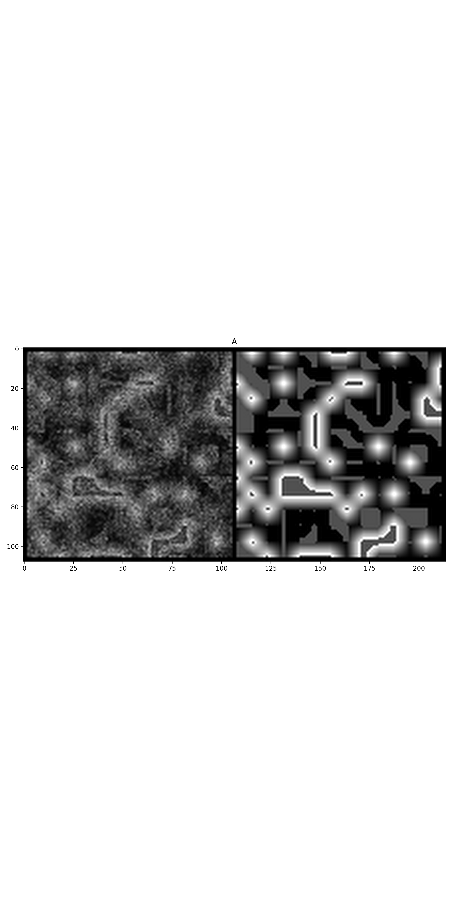

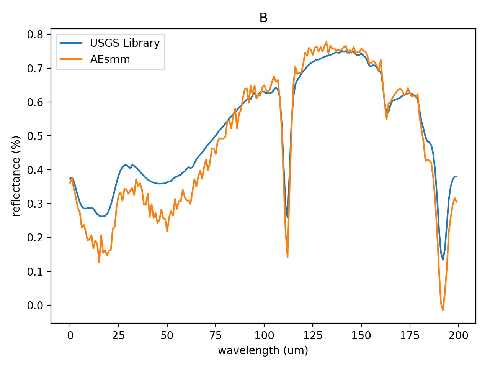

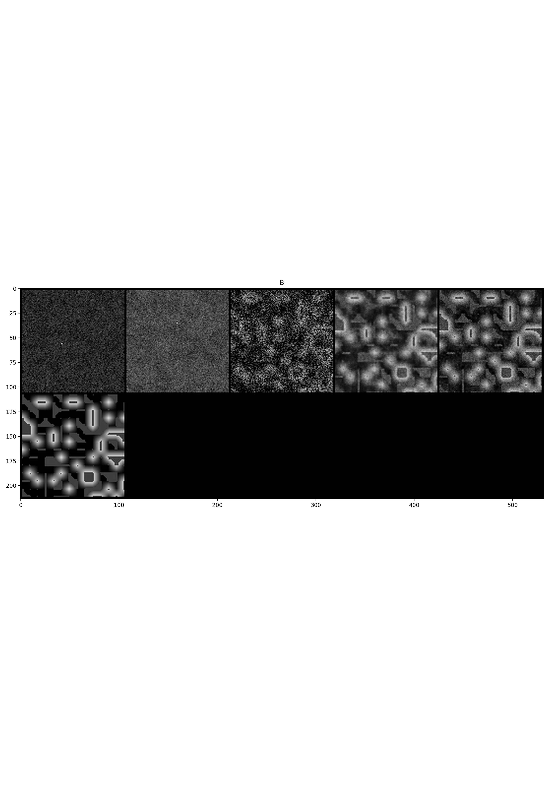

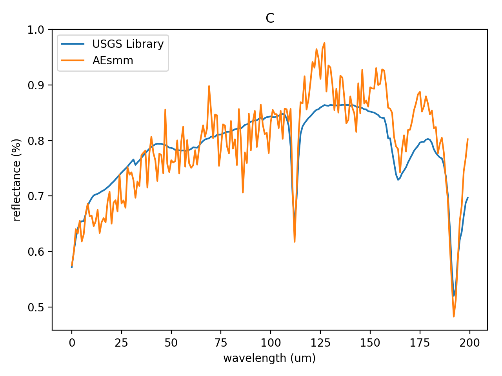

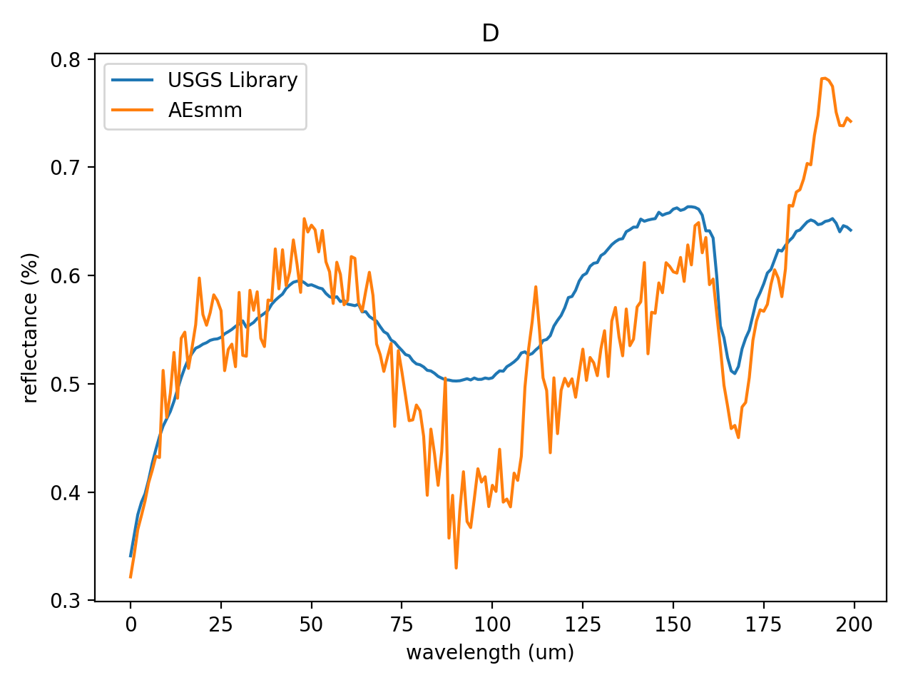

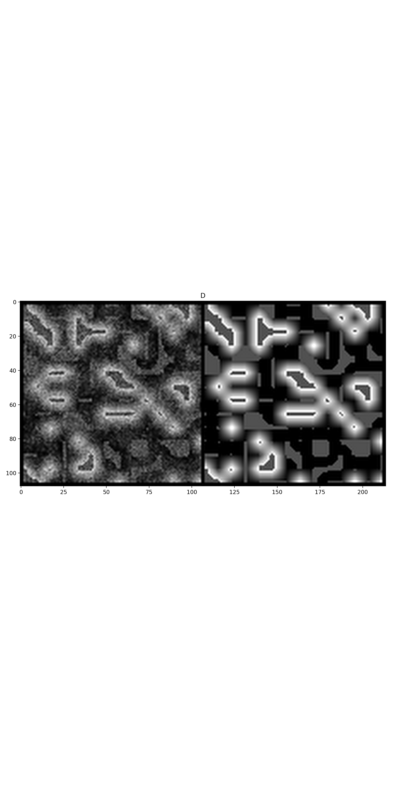

## SNR = : 20 

### Comparison between the ground-truth and extracted endmembers using PPI, N-FINDR, VCA using SAD for the simulate Dataset.

| Endmembers   |    PPI |   NFINDR |    VCA |   AEsmm_mse |   AEsmm |
|:-------------|-------:|---------:|-------:|------------:|--------:|
| A            | 0.1057 |   0.1119 | 0.0217 |      0.0664 |  **0.0122** |
| B            | 0.1571 |   0.1384 | 0.0795 |      0.0335 |  **0.0113** |
| C            | 0.0866 |   0.1010 | 0.0324 |      0.0237 |  **0.0061** |
| D            | 0.1611 |   0.1355 | 0.0518 |      0.0919 |  **0.0130** |

### SAD Statistics for Cuprite Dataset. 

| Statistics   |    PPI |   NFINDR |    VCA |   AEsmm_mse |   AEsmm |
|:-------------|-------:|---------:|-------:|------------:|--------:|
| _Mean_       | 0.1276 |   0.1217 | 0.0463 |      0.0539 |  **0.0106** |
| _Std_        | **0.0000** |   **0.0000** | **0.0000** |      **0.0000** |  **0.0000** |
| _Time_       | 3.8439 |   3.4763 | 2.8366 |     19.7162 | **19.2505** |
| _1-Ssim_     | 0.5447 |   0.4436 | 0.3400 |      0.3542 |  **0.0703** |
| _Mse_        | 0.0071 |   0.0069 | **0.0052** |      **0.0052** |  **0.0052** |

### Comparison between the ground-truth and extracted endmembers using PPI, N-FINDR, VCA, using AAD for the simulate Dataset.

| Abundance   |    PPI |   NFINDR |    VCA |   AEsmm_mse |   AEsmm |
|:------------|-------:|---------:|-------:|------------:|--------:|
| A           | 0.6218 |   0.4733 | 0.5799 |      0.2499 |  **0.1132** |
| B           | 0.2226 |   0.1935 | 0.1924 |      0.1840 |  **0.0569** |
| C           | 0.6892 |   0.6083 | 0.4414 |      0.4117 |  **0.1063** |
| D           | 0.8077 |   0.4344 | 0.2840 |      0.1546 |  **0.0760** |

### AAD Statistics for Cuprite Dataset. 

| Statistics   |    PPI |   NFINDR |    VCA |   AEsmm_mse |   AEsmm |
|:-------------|-------:|---------:|-------:|------------:|--------:|
| _Mean_       | 0.5853 |   0.4274 | 0.3744 |      0.2500 |  **0.0881** |
| _Std_        | **0.0000** |   **0.0000** | **0.0000** |      **0.0000** |  **0.0000** |
| _Time_       | 3.8439 |   3.4763 | 2.8366 |     19.7162 | **19.2505** |
| _1-Ssim_     | 0.5447 |   0.4436 | 0.3400 |      0.3542 |  **0.0703** |
| _Mse_        | 0.0071 |   0.0069 | **0.0052** |      **0.0052** |  **0.0052** |

### Comparison between the ground-truth Laboratory Reflectances and extracted endmembers using PPI, N-FINDR, VCA using SID for the Cuprite Dataset.

| Endmembers   |    PPI |   NFINDR |    VCA |   AEsmm_mse |   AEsmm |
|:-------------|-------:|---------:|-------:|------------:|--------:|
| A            | 0.0118 |   0.0133 | 0.0005 |      0.0055 |  **0.0002** |
| B            | 0.0339 |   0.0262 | 0.0086 |      0.0016 |  **0.0002** |
| C            | 0.0081 |   0.0109 | 0.0011 |      0.0006 |  **0.0000** |
| D            | 0.0265 |   0.0206 | 0.0027 |      0.0083 |  **0.0002** |

### SID Statistics for Simulated Data. 

| Statistics   |    PPI |   NFINDR |    VCA |   AEsmm_mse |   AEsmm |
|:-------------|-------:|---------:|-------:|------------:|--------:|
| _Mean_       | 0.0201 |   0.0177 | 0.0032 |      0.0040 |  **0.0001** |
| _Std_        | **0.0000** |   **0.0000** | **0.0000** |      **0.0000** |  **0.0000** |
| _Time_       | 3.8439 |   3.4763 | 2.8366 |     19.7162 | **19.2505** |
| _1-Ssim_     | 0.5447 |   0.4436 | 0.3400 |      0.3542 |  **0.0703** |
| _Mse_        | 0.0071 |   0.0069 | **0.0052** |      **0.0052** |  **0.0052** |

### Comparison between the ground-truth Laboratory Reflectances and extracted endmembers using PPI, N-FINDR, VCA using AID for the Cuprite Dataset.

| Abundance   |    PPI |   NFINDR |    VCA |   AEsmm_mse |   AEsmm |
|:------------|-------:|---------:|-------:|------------:|--------:|
| A           | 4.9531 |   3.7266 | 7.2410 |      1.0769 |  **0.3454** |
| B           | 1.3777 |   0.9464 | 0.5993 |      1.0260 |  **0.1826** |
| C           | 6.2222 |   5.8214 | 2.8939 |      3.3270 |  **0.7029** |
| D           | 6.9363 |   3.3132 | 1.9459 |      1.2477 |  **0.3158** |

### AID Statistics for Simulated Data. 

| Statistics   |    PPI |   NFINDR |    VCA |   AEsmm_mse |   AEsmm |
|:-------------|-------:|---------:|-------:|------------:|--------:|
| _Mean_       | 4.8723 |   3.4519 | 3.1700 |      1.6694 |  **0.3867** |
| _Std_        | **0.0000** |   **0.0000** | **0.0000** |      **0.0000** |  **0.0000** |
| _Time_       | 3.8439 |   3.4763 | 2.8366 |     19.7162 | **19.2505** |
| _1-Ssim_     | 0.5473 |   0.4436 | 0.3400 |      0.3542 |  **0.0703** |
| _Mse_        | 0.0071 |   0.0069 | **0.0052** |      **0.0052** |  **0.0052** |

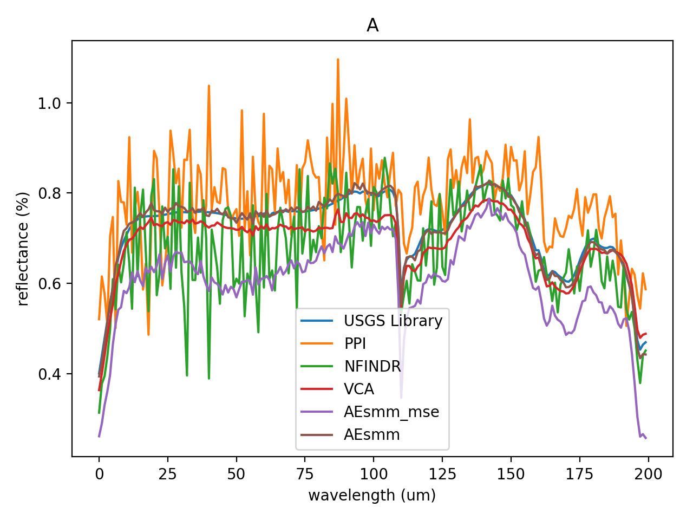

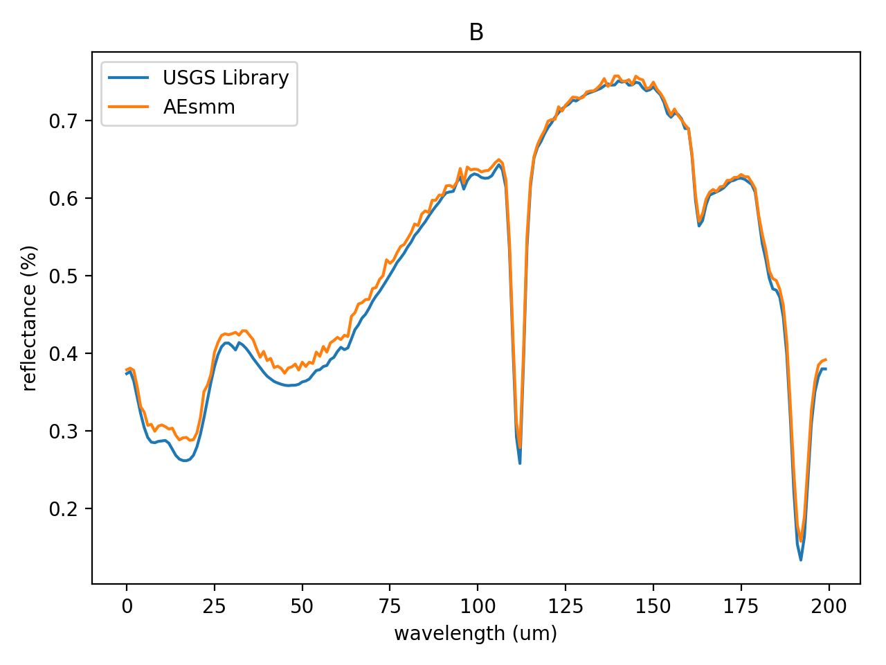

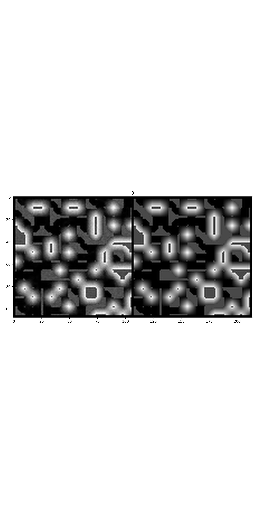

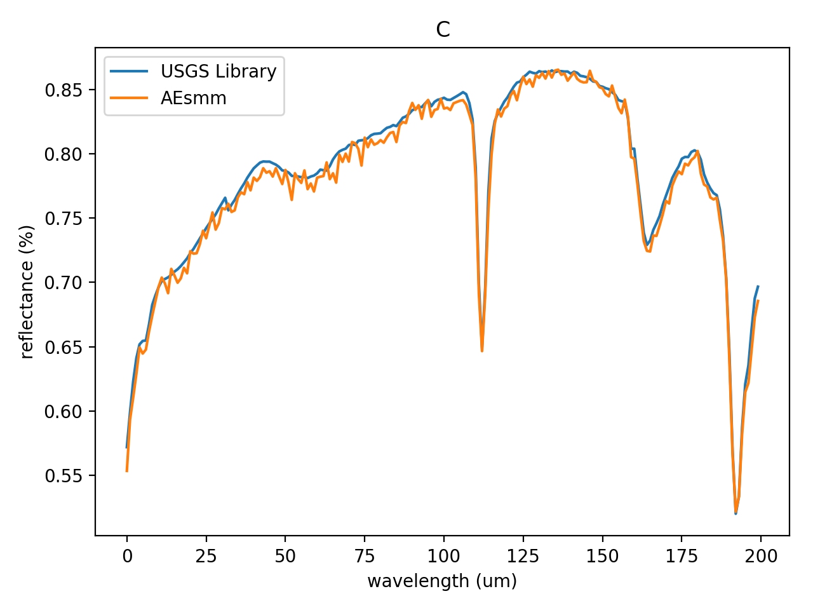

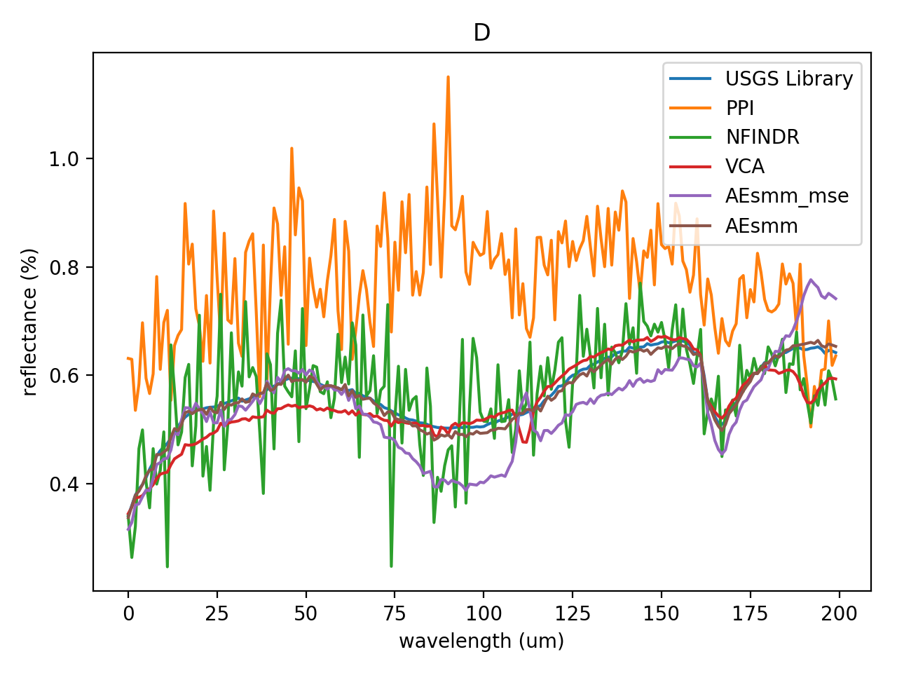

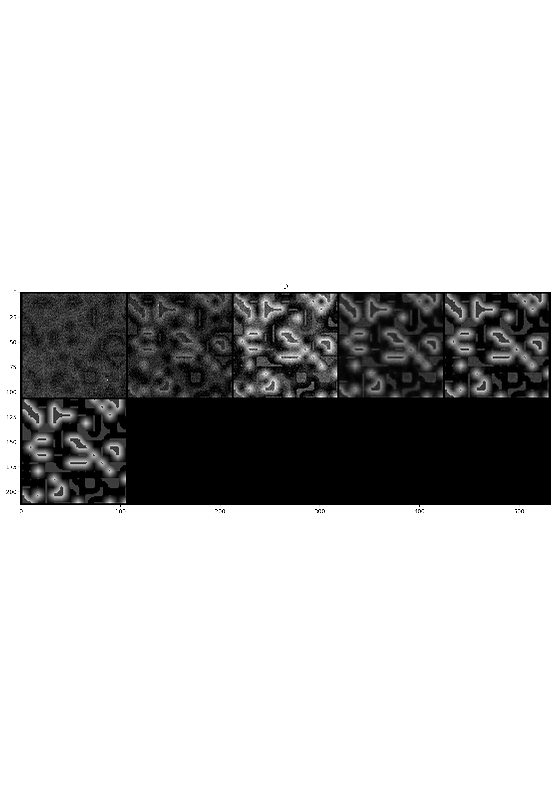

## SNR = : 30 

### Comparison between the ground-truth and extracted endmembers using PPI, N-FINDR, VCA using SAD for the simulate Dataset.

| Endmembers   |    PPI |   NFINDR |    VCA |   AEsmm_mse |   AEsmm |
|:-------------|-------:|---------:|-------:|------------:|--------:|
| A            | 0.0634 |   0.0423 | 0.0213 |      0.0300 |  **0.0046** |
| B            | 0.0720 |   0.0745 | 0.0630 |      0.0342 |  **0.0320** |
| C            | 0.0327 |   0.0343 | 0.0162 |      0.0056 |  **0.0047** |
| D            | 0.1262 |   0.0520 | 0.0284 |      0.0296 |  **0.0111** |

### SAD Statistics for Cuprite Dataset. 

| Statistics   |    PPI |   NFINDR |    VCA |   AEsmm_mse |   AEsmm |
|:-------------|-------:|---------:|-------:|------------:|--------:|
| _Mean_       | 0.0736 |   0.0508 | 0.0322 |      0.0249 |  **0.0131** |
| _Std_        | **0.0000** |   **0.0000** | **0.0000** |      **0.0000** |  **0.0000** |
| _Time_       | 3.6601 |   3.2707 | 2.9918 |     **19.4804** | 20.1183 |
| _1-Ssim_     | 0.4502 |   0.1873 | 0.1369 |      0.2140 |  **0.0597** |
| _Mse_        | 0.0012 |   0.0008 | **0.0005** |      0.0006 |  **0.0005** |

### Comparison between the ground-truth and extracted endmembers using PPI, N-FINDR, VCA, using AAD for the simulate Dataset.

| Abundance   |    PPI |   NFINDR |    VCA |   AEsmm_mse |   AEsmm |
|:------------|-------:|---------:|-------:|------------:|--------:|
| A           | 0.5618 |   0.2698 | 0.1851 |      0.1836 |  **0.1099** |
| B           | 0.1385 |   0.0748 | 0.0837 |      0.1028 |  **0.0438** |
| C           | 0.5922 |   0.3311 | 0.2088 |      0.2619 |  **0.0802** |
| D           | 0.7075 |   0.1689 | 0.2139 |      0.1304 |  **0.0572** |

### AAD Statistics for Cuprite Dataset. 

| Statistics   |    PPI |   NFINDR |    VCA |   AEsmm_mse |   AEsmm |
|:-------------|-------:|---------:|-------:|------------:|--------:|
| _Mean_       | 0.5000 |   0.2111 | 0.1729 |      0.1697 |  **0.0727** |
| _Std_        | **0.0000** |   **0.0000** | **0.0000** |      **0.0000** |  **0.0000** |
| _Time_       | 3.6601 |   3.2707 | 2.9918 |     **19.4804** | 20.1183 |
| _1-Ssim_     | 0.4502 |   0.1873 | 0.1369 |      0.2140 |  **0.0597** |
| _Mse_        | 0.0012 |   0.0008 | **0.0005** |      0.0006 |  **0.0005** |

### Comparison between the ground-truth Laboratory Reflectances and extracted endmembers using PPI, N-FINDR, VCA using SID for the Cuprite Dataset.

| Endmembers   |    PPI |   NFINDR |    VCA |   AEsmm_mse |   AEsmm |
|:-------------|-------:|---------:|-------:|------------:|--------:|
| A            | 0.0045 |   0.0018 | 0.0005 |      0.0011 |  **0.0000** |
| B            | 0.0078 |   0.0078 | 0.0061 |      0.0017 |  **0.0015** |
| C            | 0.0011 |   0.0012 | 0.0003 |      **0.0000** |  **0.0000** |
| D            | 0.0166 |   0.0027 | 0.0008 |      0.0009 |  **0.0001** |

### SID Statistics for Simulated Data. 

| Statistics   |    PPI |   NFINDR |    VCA |   AEsmm_mse |   AEsmm |
|:-------------|-------:|---------:|-------:|------------:|--------:|
| _Mean_       | 0.0075 |   0.0034 | 0.0019 |      0.0009 |  **0.0004** |
| _Std_        | **0.0000** |   **0.0000** | **0.0000** |      **0.0000** |  **0.0000** |
| _Time_       | 3.6601 |   3.2707 | 2.9918 |     **19.4804** | 20.1183 |
| _1-Ssim_     | 0.4502 |   0.1873 | 0.1369 |      0.2140 |  **0.0597** |
| _Mse_        | 0.0012 |   0.0008 | **0.0005** |      0.0006 |  **0.0005** |

### Comparison between the ground-truth Laboratory Reflectances and extracted endmembers using PPI, N-FINDR, VCA using AID for the Cuprite Dataset.

| Abundance   |    PPI |   NFINDR |    VCA |   AEsmm_mse |   AEsmm |
|:------------|-------:|---------:|-------:|------------:|--------:|
| A           | 4.4412 |   1.6539 | 0.7308 |      0.9071 |  **0.2285** |
| B           | 0.6582 |   **0.0781** | 0.2126 |      0.4877 |  0.1263 |
| C           | 5.0643 |   2.8339 | 0.8049 |      2.0507 |  **0.2761** |
| D           | 6.2188 |   0.6704 | 0.7546 |      0.7374 |  **0.1736** |

### AID Statistics for Simulated Data. 

| Statistics   |    PPI |   NFINDR |    VCA |   AEsmm_mse |   AEsmm |
|:-------------|-------:|---------:|-------:|------------:|--------:|
| _Mean_       | 4.0956 |   1.3091 | 0.6257 |      1.0457 |  **0.2011** |
| _Std_        | **0.0000** |   **0.0000** | **0.0000** |      **0.0000** |  **0.0000** |
| _Time_       | 3.6601 |   3.2707 | 2.9918 |     **19.4804** | 20.1183 |
| _1-Ssim_     | 0.4502 |   0.1873 | 0.1369 |      0.2140 |  **0.0597** |
| _Mse_        | 0.0012 |   0.0008 | **0.0005** |      0.0006 |  **0.0005** |

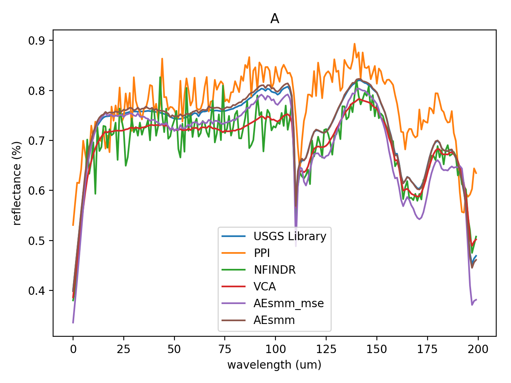

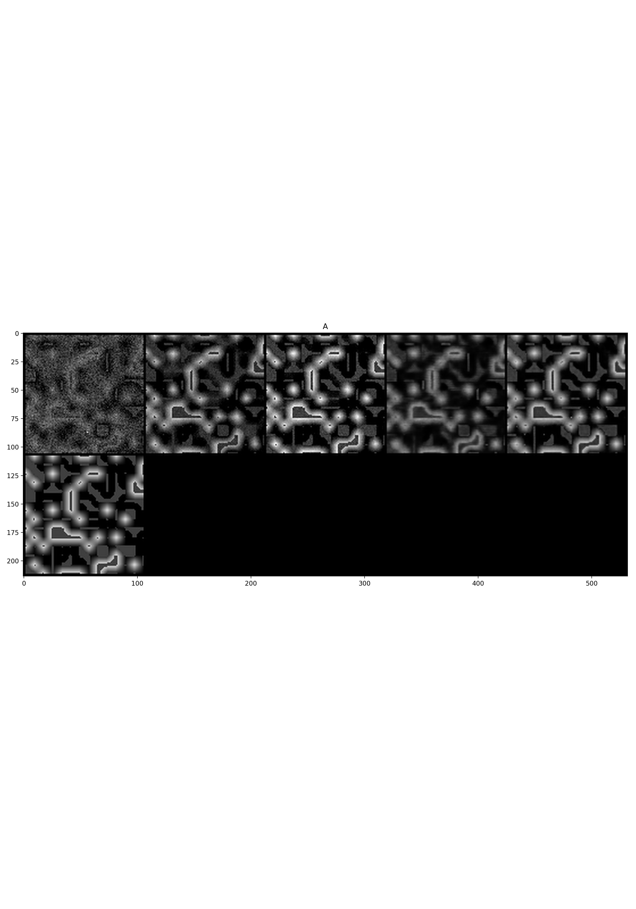

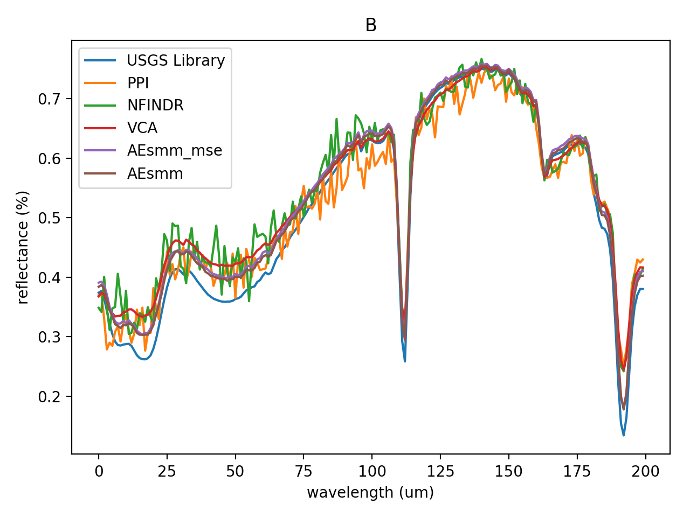

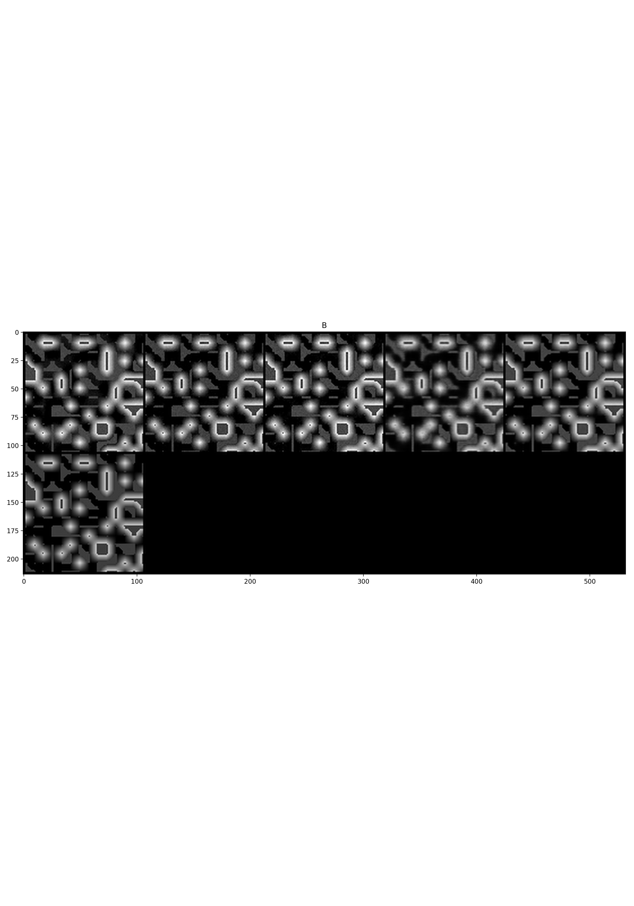

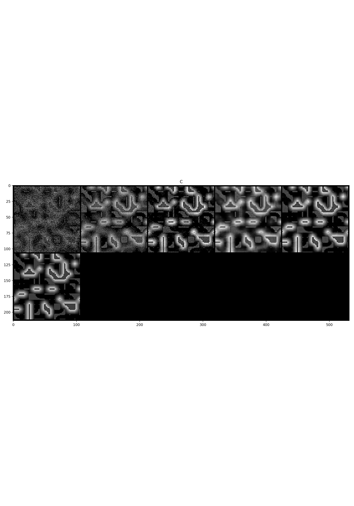

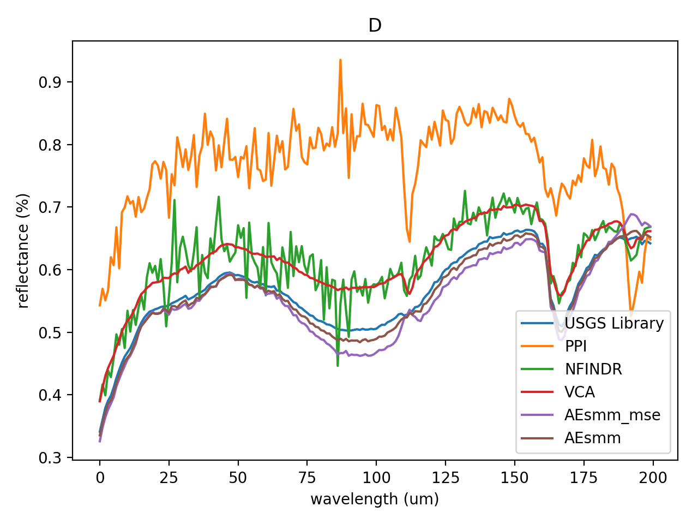

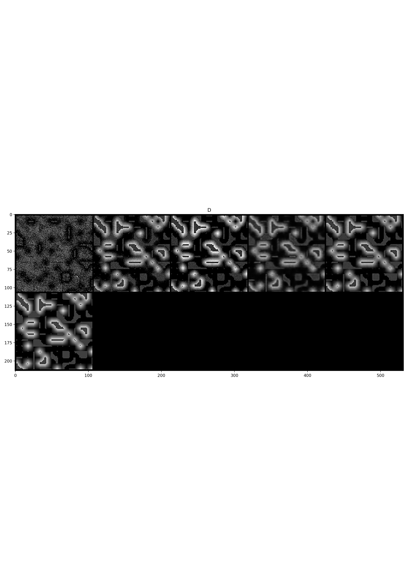

## SNR = : 40 

### Comparison between the ground-truth and extracted endmembers using PPI, N-FINDR, VCA using SAD for the simulate Dataset.

| Endmembers   |    PPI |   NFINDR |    VCA |   AEsmm_mse |   AEsmm |
|:-------------|-------:|---------:|-------:|------------:|--------:|
| A            | 0.0620 |   0.0269 | 0.0164 |      0.0602 |  **0.0094** |
| B            | 0.0645 |   0.0737 | 0.0657 |      **0.0189** |  0.0265 |
| C            | 0.0183 |   0.0155 | 0.0209 |      0.0292 |  **0.0054** |
| D            | 0.1227 |   0.0417 | 0.0368 |      0.0540 |  **0.0025** |

### SAD Statistics for Cuprite Dataset. 

| Statistics   |    PPI |   NFINDR |    VCA |   AEsmm_mse |   AEsmm |
|:-------------|-------:|---------:|-------:|------------:|--------:|
| _Mean_       | 0.0669 |   0.0394 | 0.0349 |      0.0406 |  **0.0109** |
| _Std_        | **0.0000** |   **0.0000** | **0.0000** |      **0.0000** |  **0.0000** |
| _Time_       | 3.6512 |   3.3422 | 2.9163 |     19.8059 | **19.4119** |
| _1-Ssim_     | 0.5565 |   0.1189 | 0.1893 |      0.2856 |  **0.0818** |
| _Mse_        | 0.0006 |   **0.0001** | **0.0001** |      **0.0001** |  **0.0001** |

### Comparison between the ground-truth and extracted endmembers using PPI, N-FINDR, VCA, using AAD for the simulate Dataset.

| Abundance   |    PPI |   NFINDR |    VCA |   AEsmm_mse |   AEsmm |
|:------------|-------:|---------:|-------:|------------:|--------:|
| A           | 0.5500 |   0.2405 | 0.2408 |      0.2777 |  **0.1139** |
| B           | 0.1403 |   0.1045 | **0.0565** |      0.2238 |  0.0595 |
| C           | 0.7621 |   0.2368 | 0.2791 |      0.3355 |  **0.0951** |
| D           | 0.5437 |   0.1785 | 0.2375 |      0.1487 |  **0.0680** |

### AAD Statistics for Cuprite Dataset. 

| Statistics   |    PPI |   NFINDR |    VCA |   AEsmm_mse |   AEsmm |
|:-------------|-------:|---------:|-------:|------------:|--------:|
| _Mean_       | 0.4990 |   0.1901 | 0.2035 |      0.2464 |  **0.0841** |
| _Std_        | **0.0000** |   **0.0000** | **0.0000** |      **0.0000** |  **0.0000** |
| _Time_       | 3.6512 |   3.3422 | 2.9163 |     19.8059 | **19.4119** |
| _1-Ssim_     | 0.4896 |   0.1189 | 0.1893 |      0.2856 |  **0.0818** |
| _Mse_        | 0.0006 |   **0.0001** | **0.0001** |      **0.0001** |  **0.0001** |

### Comparison between the ground-truth Laboratory Reflectances and extracted endmembers using PPI, N-FINDR, VCA using SID for the Cuprite Dataset.

| Endmembers   |    PPI |   NFINDR |    VCA |   AEsmm_mse |   AEsmm |
|:-------------|-------:|---------:|-------:|------------:|--------:|
| A            | 0.0044 |   0.0008 | 0.0003 |      0.0039 |  **0.0001** |
| B            | 0.0063 |   0.0076 | 0.0065 |      **0.0007** |  0.0011 |
| C            | 0.0004 |   0.0003 | 0.0005 |      0.0009 |  **0.0000** |
| D            | 0.0157 |   0.0018 | 0.0014 |      0.0028 |  **0.0000** |

### SID Statistics for Simulated Data. 

| Statistics   |    PPI |   NFINDR |    VCA |   AEsmm_mse |   AEsmm |
|:-------------|-------:|---------:|-------:|------------:|--------:|
| _Mean_       | 0.0067 |   0.0026 | 0.0022 |      0.0021 |  **0.0003** |
| _Std_        | **0.0000** |   **0.0000** | **0.0000** |      **0.0000** |  **0.0000** |
| _Time_       | 3.6512 |   3.3422 | 2.9163 |     19.8059 | **19.4119** |
| _1-Ssim_     | 0.5565 |   0.1189 | 0.1893 |      0.2856 |  **0.0818** |
| _Mse_        | 0.0006 |   **0.0001** | **0.0001** |      **0.0001** |  **0.0001** |

### Comparison between the ground-truth Laboratory Reflectances and extracted endmembers using PPI, N-FINDR, VCA using AID for the Cuprite Dataset.

| Abundance   |    PPI |   NFINDR |    VCA |   AEsmm_mse |   AEsmm |
|:------------|-------:|---------:|-------:|------------:|--------:|
| A           | 4.3536 |   1.2107 | 0.9844 |      0.7205 |  **0.2102** |
| B           | 0.5395 |   0.1665 | 0.1716 |      1.3111 |  **0.1392** |
| C           | 6.6742 |   1.0554 | 1.1904 |      2.5699 |  **0.4580** |
| D           | 4.1937 |   0.6523 | 0.9697 |      1.0245 |  **0.1531** |

### AID Statistics for Simulated Data. 

| Statistics   |    PPI |   NFINDR |    VCA |   AEsmm_mse |   AEsmm |
|:-------------|-------:|---------:|-------:|------------:|--------:|
| _Mean_       | 3.9402 |   0.7712 | 0.8290 |      1.4065 |  **0.2401** |
| _Std_        | **0.0000** |   **0.0000** | **0.0000** |      **0.0000** |  **0.0000** |
| _Time_       | 3.6512 |   3.3422 | 2.9163 |     19.8059 | **19.4119** |
| _1-Ssim_     | 0.5045 |   0.1189 | 0.1893 |      0.2856 |  **0.0818** |
| _Mse_        | 0.0006 |   **0.0001** | **0.0001** |      **0.0001** |  **0.0001** |

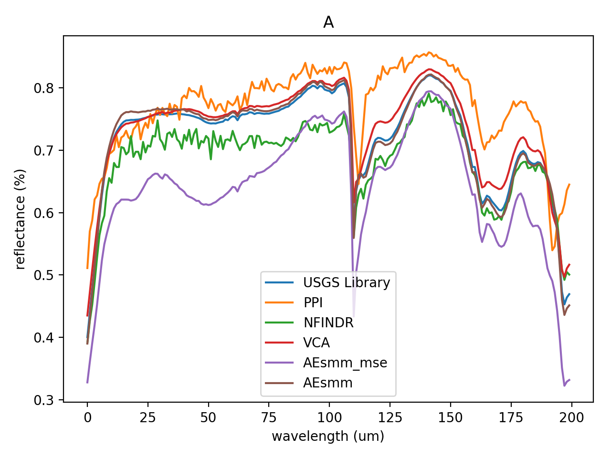

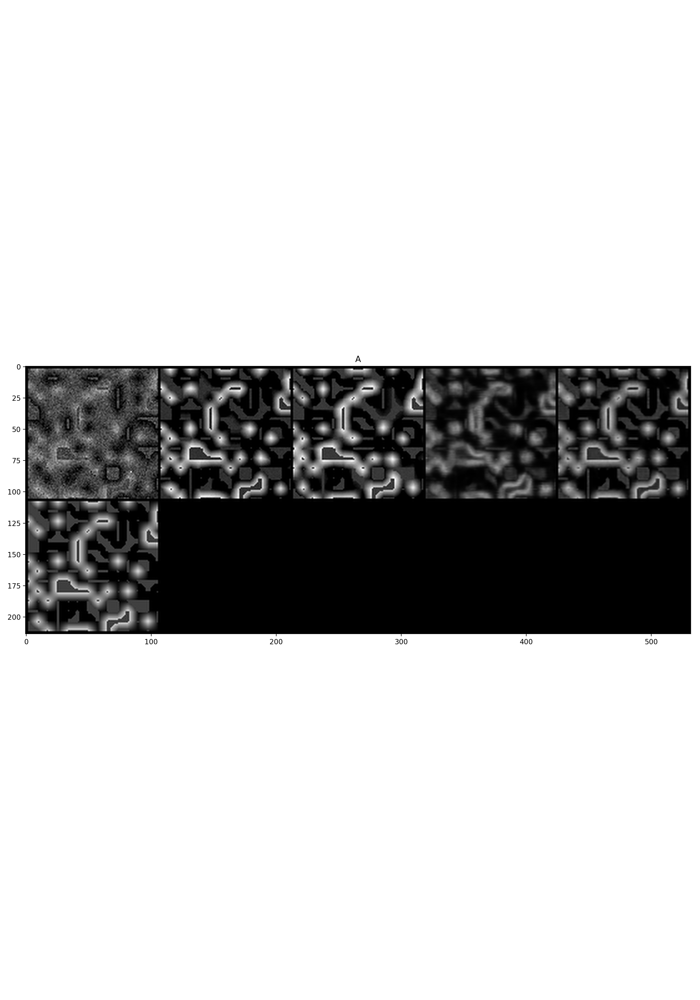

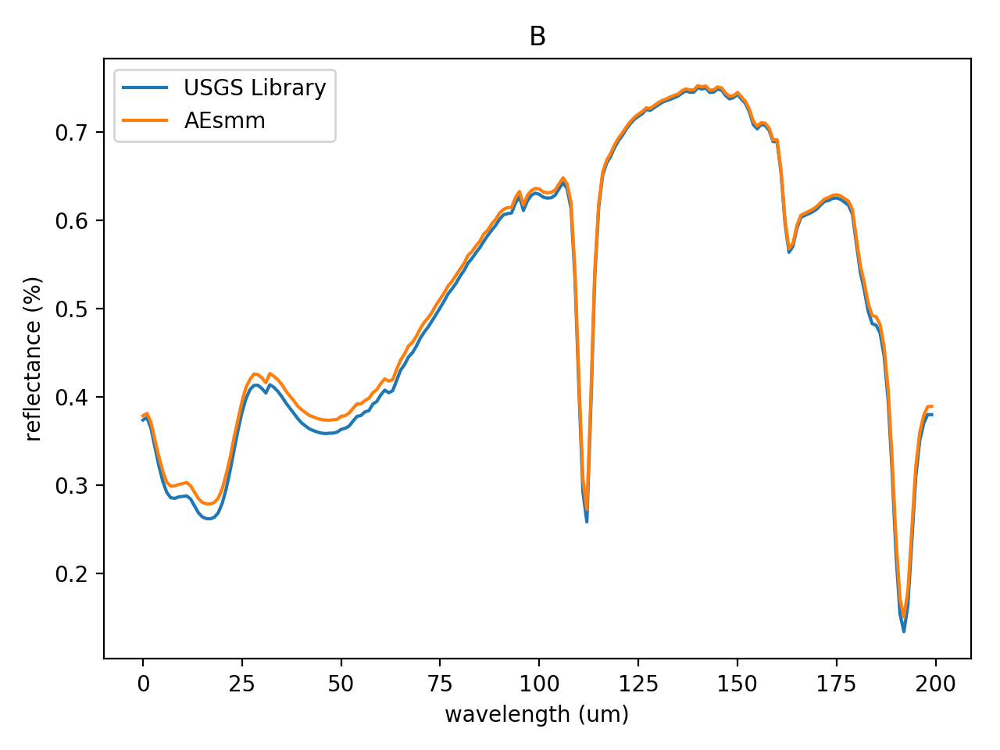

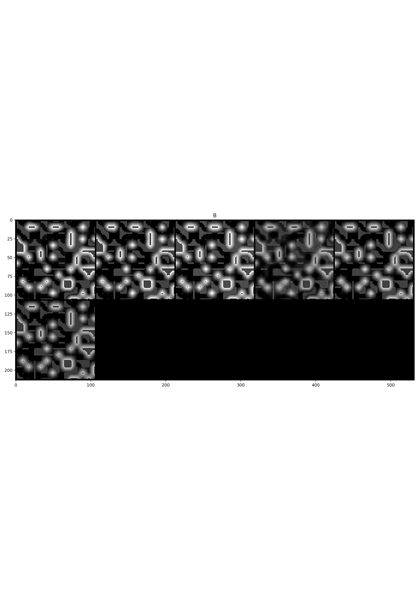

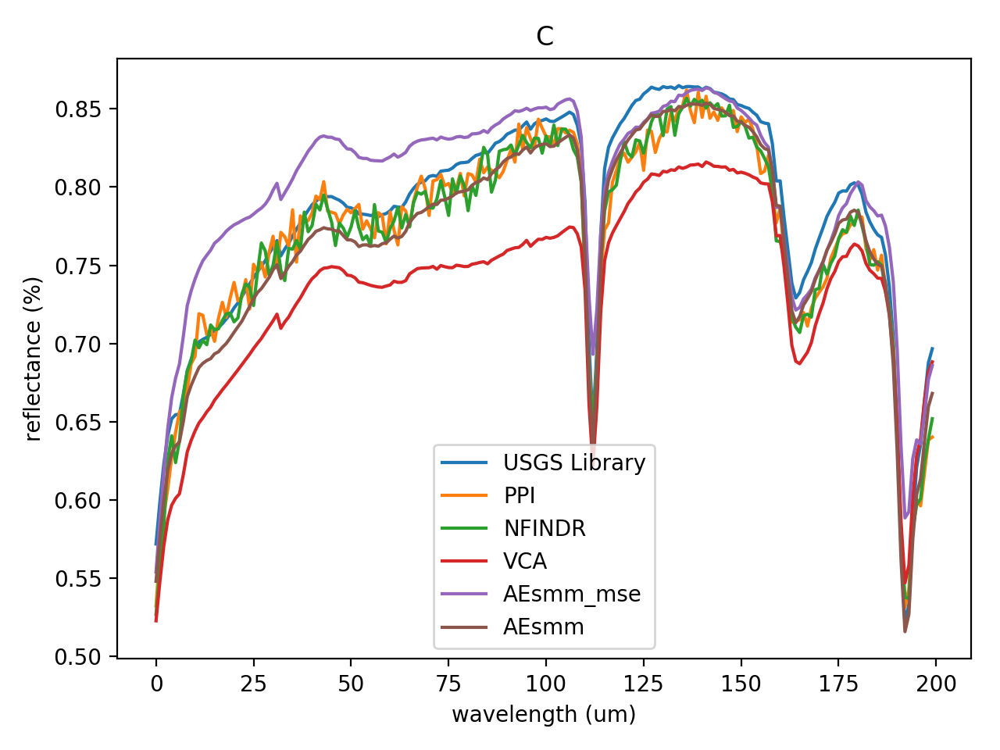

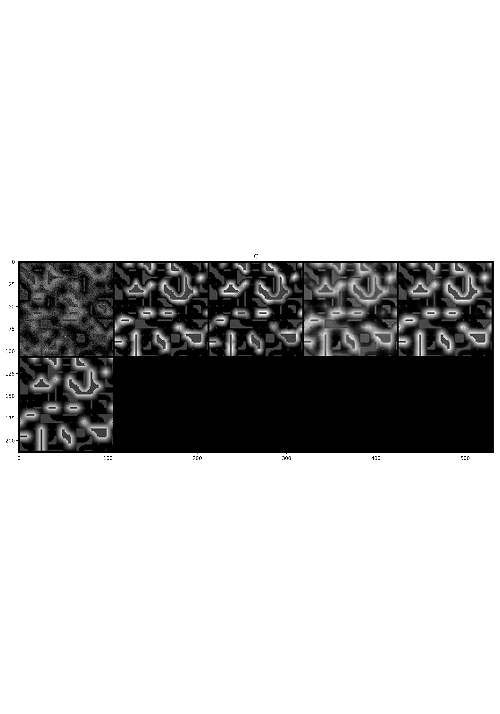

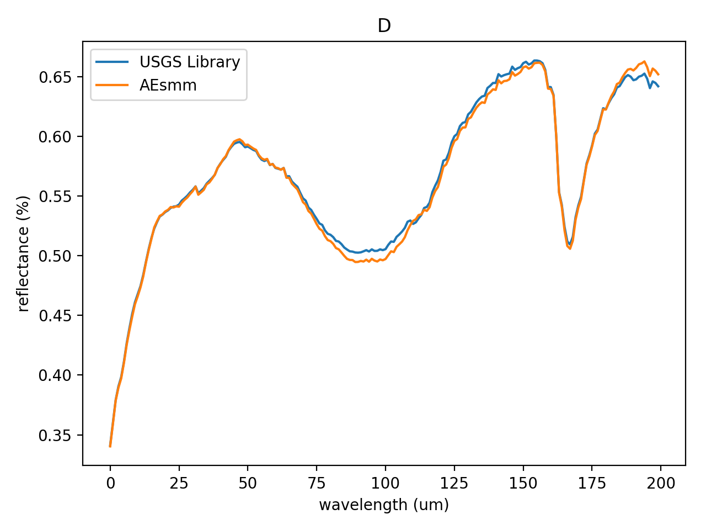

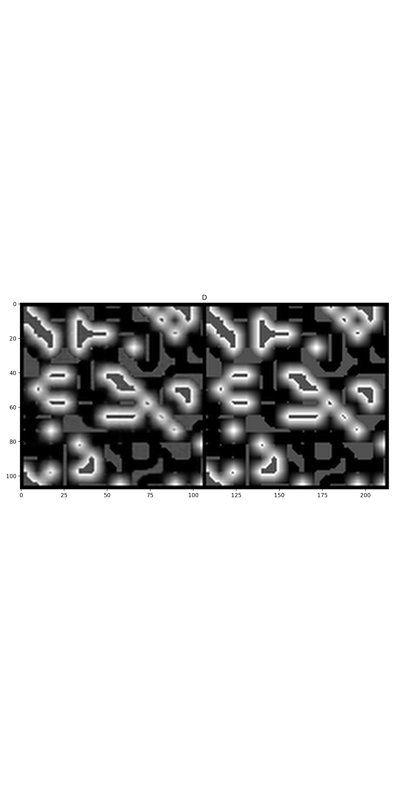

