# Comparison of Unmixing method

## Envirionment Setup: 

Monte Carlo runs: 1 

Number of endmembers to estimate: 4 

Number of skewers (PPI): 1000 

Maximum number of iterations (N-FINDR): 12 

## SNR = : 10 

### Comparison between the ground-truth and extracted endmembers using PPI, N-FINDR, VCA using SAD for the simulate Dataset.

| Endmembers   |   AEsmm |
|:-------------|--------:|
| A            |  **0.1151** |
| B            |  **0.1116** |
| C            |  **0.0572** |
| D            |  **0.1109** |

### SAD Statistics for Cuprite Dataset. 

| Statistics   |   AEsmm |
|:-------------|--------:|
| _Mean_       |  **0.0987** |
| _Std_        |  **0.0000** |
| _Time_       | **20.8136** |
| _1-Ssim_     |  **0.2875** |
| _Mse_        |  **0.0514** |

### Comparison between the ground-truth and extracted endmembers using PPI, N-FINDR, VCA, using AAD for the simulate Dataset.

| Abundance   |   AEsmm |
|:------------|--------:|
| A           |  **0.4277** |
| B           |  **0.2169** |
| C           |  **0.3623** |
| D           |  **0.3051** |

### AAD Statistics for Cuprite Dataset. 

| Statistics   |   AEsmm |
|:-------------|--------:|
| _Mean_       |  **0.3280** |
| _Std_        |  **0.0000** |
| _Time_       | **20.8136** |
| _1-Ssim_     |  **0.2875** |
| _Mse_        |  **0.0514** |

### Comparison between the ground-truth Laboratory Reflectances and extracted endmembers using PPI, N-FINDR, VCA using SID for the Cuprite Dataset.

| Endmembers   |   AEsmm |
|:-------------|--------:|
| A            |  **0.0154** |
| B            |  **0.0268** |
| C            |  **0.0033** |
| D            |  **0.0126** |

### SID Statistics for Simulated Data. 

| Statistics   |   AEsmm |
|:-------------|--------:|
| _Mean_       |  **0.0145** |
| _Std_        |  **0.0000** |
| _Time_       | **20.8136** |
| _1-Ssim_     |  **0.2875** |
| _Mse_        |  **0.0514** |

### Comparison between the ground-truth Laboratory Reflectances and extracted endmembers using PPI, N-FINDR, VCA using AID for the Cuprite Dataset.

| Abundance   |   AEsmm |
|:------------|--------:|
| A           |  **3.3096** |
| B           |  **1.4262** |
| C           |  **3.1799** |
| D           |  **2.5926** |

### AID Statistics for Simulated Data. 

| Statistics   |   AEsmm |
|:-------------|--------:|
| _Mean_       |  **2.6271** |
| _Std_        |  **0.0000** |
| _Time_       | **20.8136** |
| _1-Ssim_     |  **0.2875** |
| _Mse_        |  **0.0514** |

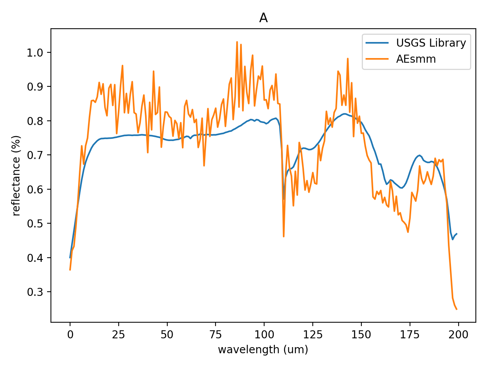

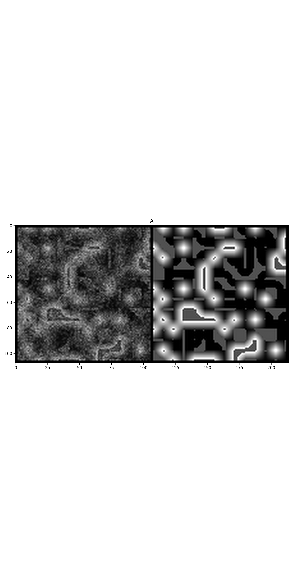

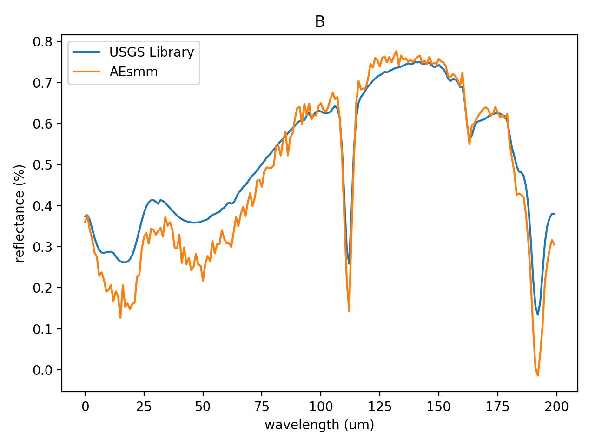

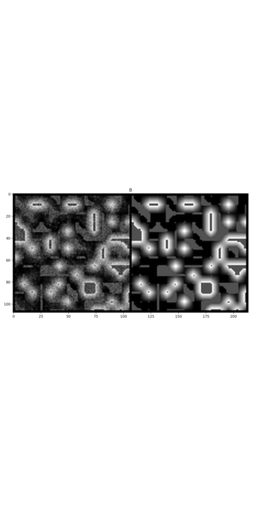

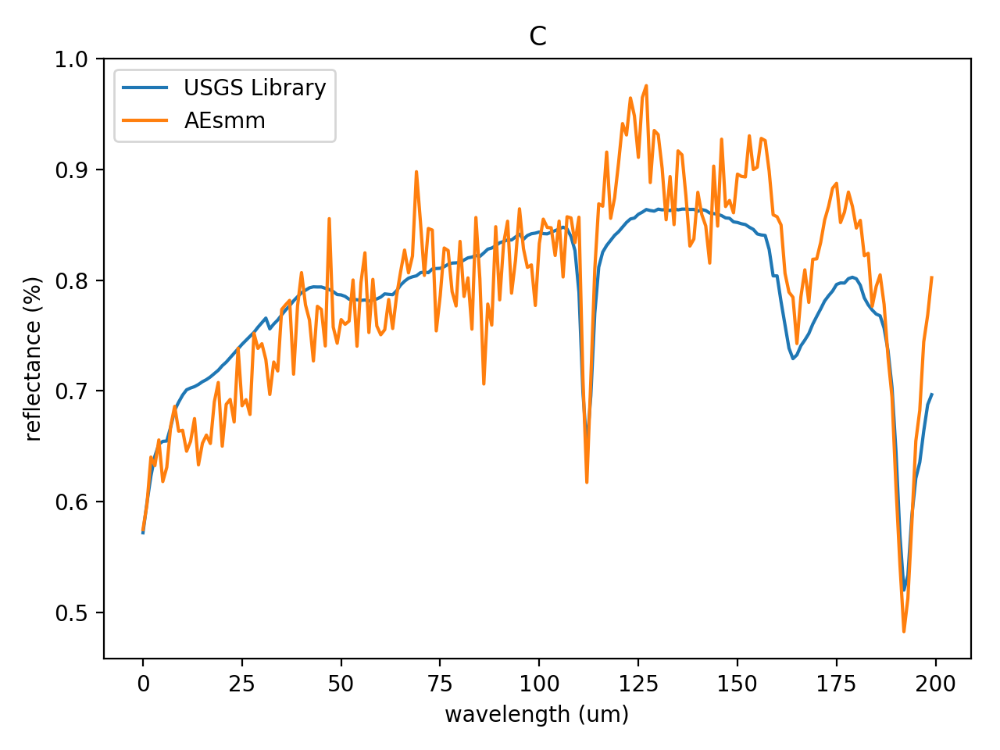

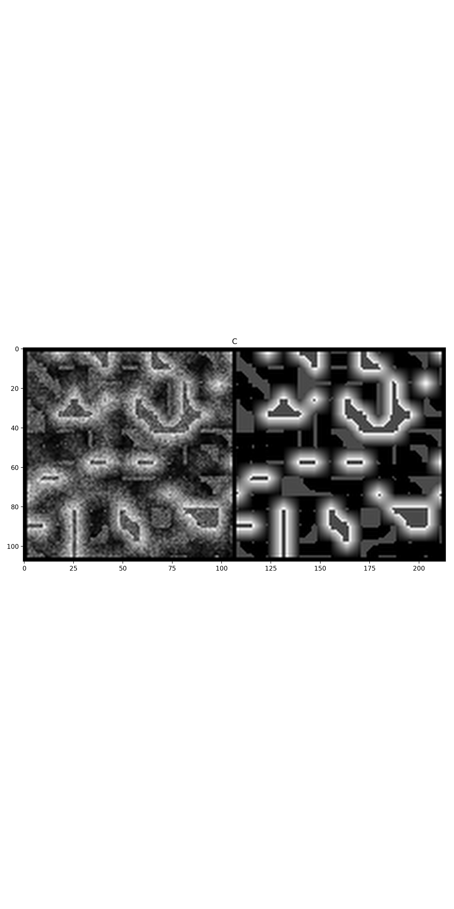

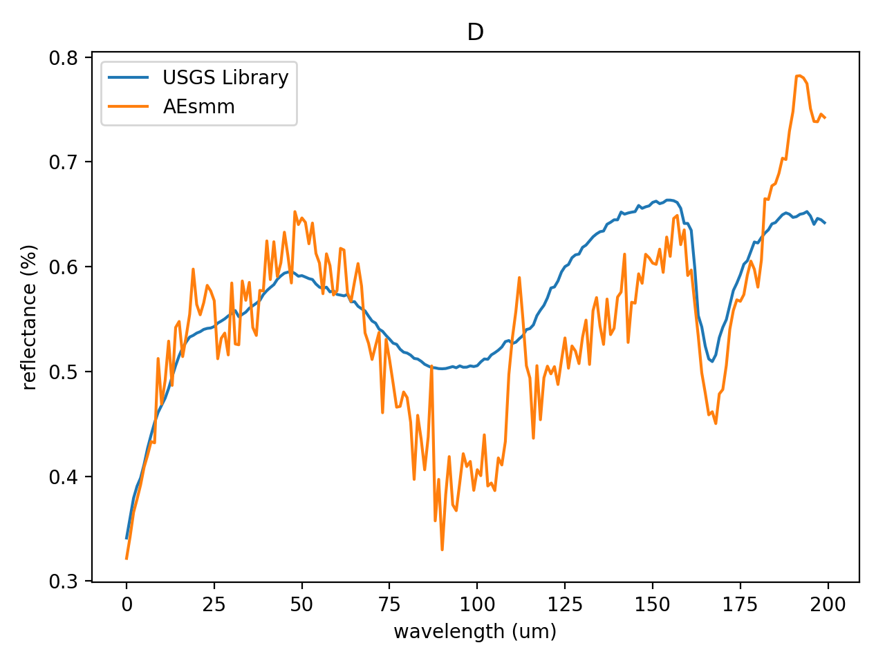

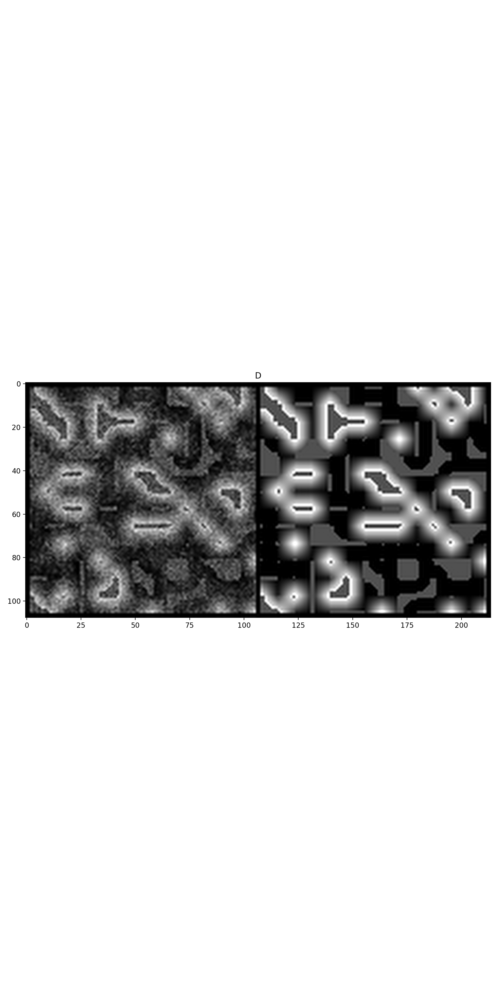

## SNR = : 20 

### Comparison between the ground-truth and extracted endmembers using PPI, N-FINDR, VCA using SAD for the simulate Dataset.

| Endmembers   |   AEsmm |
|:-------------|--------:|
| A            |  **0.0194** |
| B            |  **0.0202** |
| C            |  **0.0065** |
| D            |  **0.0156** |

### SAD Statistics for Cuprite Dataset. 

| Statistics   |   AEsmm |
|:-------------|--------:|
| _Mean_       |  **0.0154** |
| _Std_        |  **0.0000** |
| _Time_       | **20.2872** |
| _1-Ssim_     |  **0.1002** |
| _Mse_        |  **0.0052** |

### Comparison between the ground-truth and extracted endmembers using PPI, N-FINDR, VCA, using AAD for the simulate Dataset.

| Abundance   |   AEsmm |
|:------------|--------:|
| A           |  **0.1248** |
| B           |  **0.0594** |
| C           |  **0.1358** |
| D           |  **0.0785** |

### AAD Statistics for Cuprite Dataset. 

| Statistics   |   AEsmm |
|:-------------|--------:|
| _Mean_       |  **0.0996** |
| _Std_        |  **0.0000** |
| _Time_       | **20.2872** |
| _1-Ssim_     |  **0.1002** |
| _Mse_        |  **0.0052** |

### Comparison between the ground-truth Laboratory Reflectances and extracted endmembers using PPI, N-FINDR, VCA using SID for the Cuprite Dataset.

| Endmembers   |   AEsmm |
|:-------------|--------:|
| A            |  **0.0004** |
| B            |  **0.0006** |
| C            |  **0.0000** |
| D            |  **0.0002** |

### SID Statistics for Simulated Data. 

| Statistics   |   AEsmm |
|:-------------|--------:|
| _Mean_       |  **0.0003** |
| _Std_        |  **0.0000** |
| _Time_       | **20.2872** |
| _1-Ssim_     |  **0.1002** |
| _Mse_        |  **0.0052** |

### Comparison between the ground-truth Laboratory Reflectances and extracted endmembers using PPI, N-FINDR, VCA using AID for the Cuprite Dataset.

| Abundance   |   AEsmm |
|:------------|--------:|
| A           |  **0.3606** |
| B           |  **0.2005** |
| C           |  **0.9711** |
| D           |  **0.3235** |

### AID Statistics for Simulated Data. 

| Statistics   |   AEsmm |
|:-------------|--------:|
| _Mean_       |  **0.4639** |
| _Std_        |  **0.0000** |
| _Time_       | **20.2872** |
| _1-Ssim_     |  **0.1002** |
| _Mse_        |  **0.0052** |

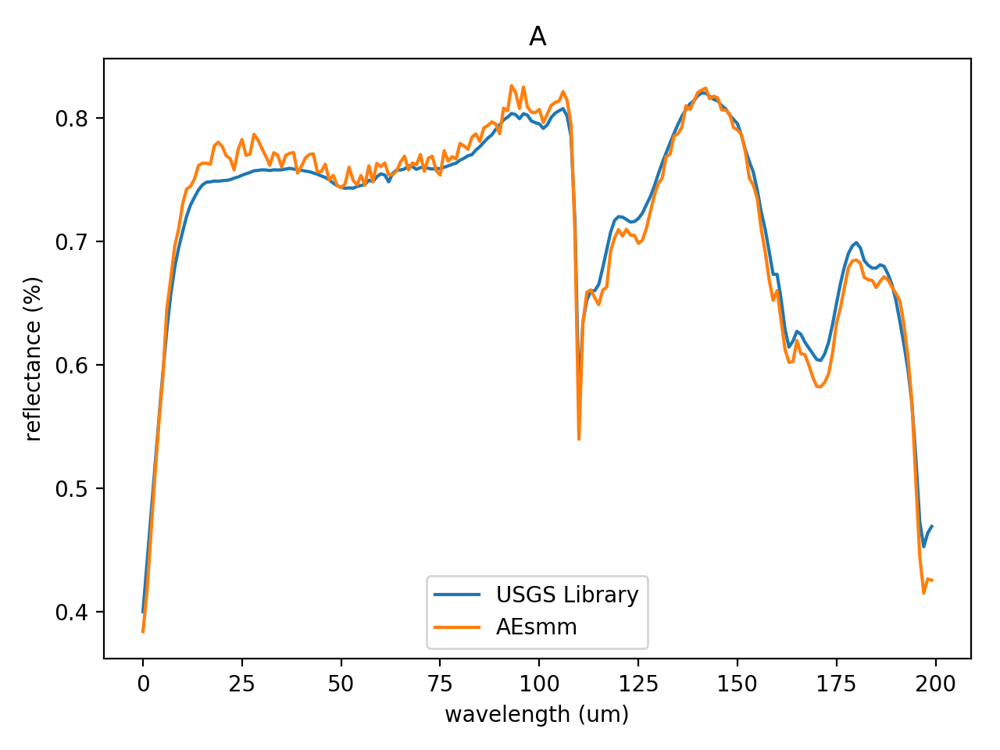

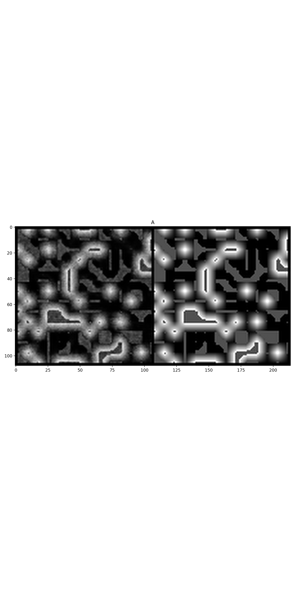

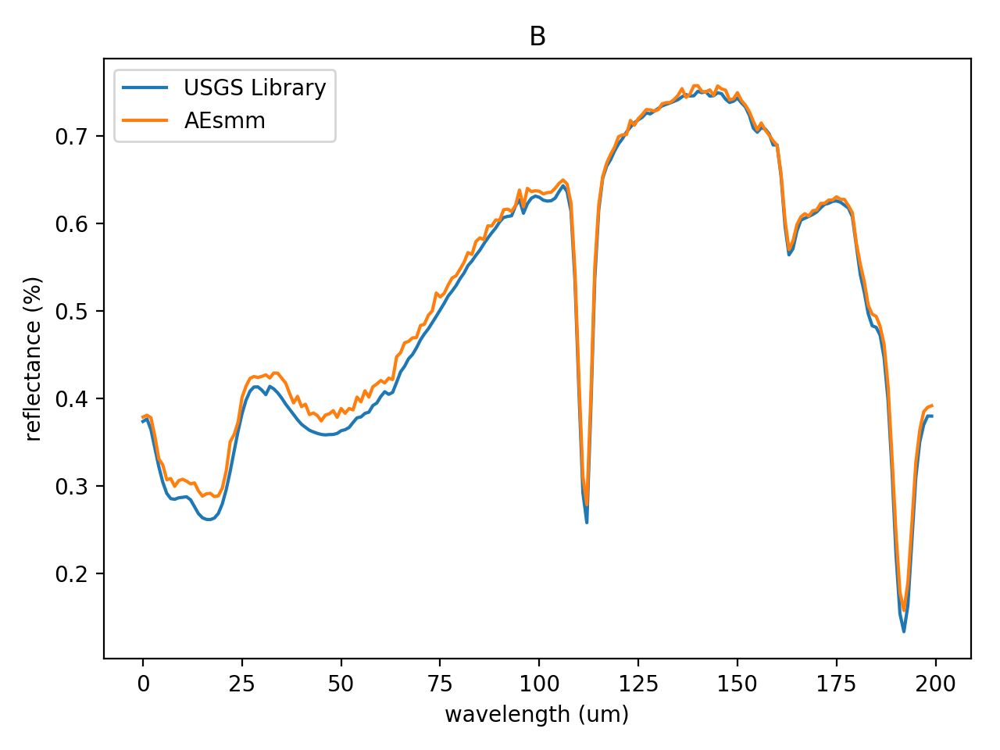

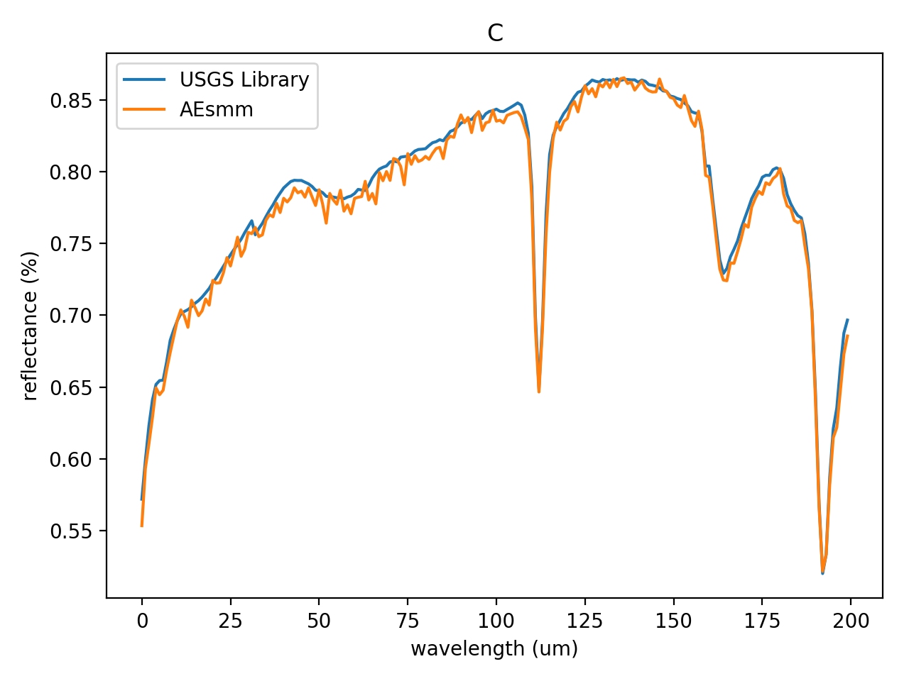

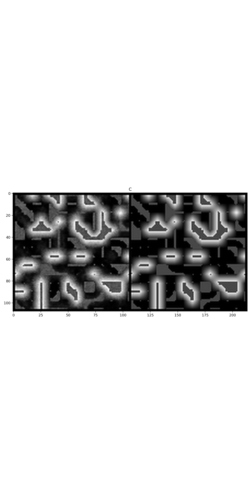

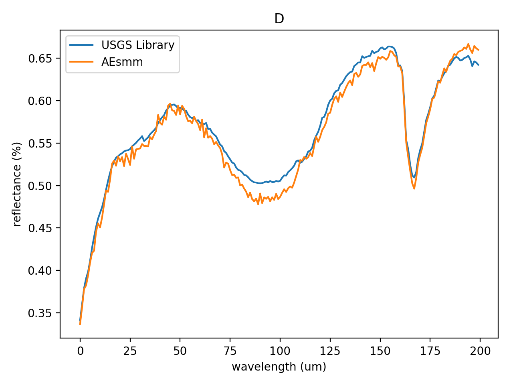

## SNR = : 30 

### Comparison between the ground-truth and extracted endmembers using PPI, N-FINDR, VCA using SAD for the simulate Dataset.

| Endmembers   |   AEsmm |
|:-------------|--------:|
| A            |  **0.0076** |
| B            |  **0.0197** |
| C            |  **0.0048** |
| D            |  **0.0046** |

### SAD Statistics for Cuprite Dataset. 

| Statistics   |   AEsmm |
|:-------------|--------:|
| _Mean_       |  **0.0092** |
| _Std_        |  **0.0000** |
| _Time_       | **20.2613** |
| _1-Ssim_     |  **0.0648** |
| _Mse_        |  **0.0005** |

### Comparison between the ground-truth and extracted endmembers using PPI, N-FINDR, VCA, using AAD for the simulate Dataset.

| Abundance   |   AEsmm |
|:------------|--------:|
| A           |  **0.1035** |
| B           |  **0.0464** |
| C           |  **0.0840** |
| D           |  **0.0585** |

### AAD Statistics for Cuprite Dataset. 

| Statistics   |   AEsmm |
|:-------------|--------:|
| _Mean_       |  **0.0731** |
| _Std_        |  **0.0000** |
| _Time_       | **20.2613** |
| _1-Ssim_     |  **0.0648** |
| _Mse_        |  **0.0005** |

### Comparison between the ground-truth Laboratory Reflectances and extracted endmembers using PPI, N-FINDR, VCA using SID for the Cuprite Dataset.

| Endmembers   |   AEsmm |
|:-------------|--------:|
| A            |  **0.0001** |
| B            |  **0.0006** |
| C            |  **0.0000** |
| D            |  **0.0000** |

### SID Statistics for Simulated Data. 

| Statistics   |   AEsmm |
|:-------------|--------:|
| _Mean_       |  **0.0002** |
| _Std_        |  **0.0000** |
| _Time_       | **20.2613** |
| _1-Ssim_     |  **0.0648** |
| _Mse_        |  **0.0005** |

### Comparison between the ground-truth Laboratory Reflectances and extracted endmembers using PPI, N-FINDR, VCA using AID for the Cuprite Dataset.

| Abundance   |   AEsmm |
|:------------|--------:|
| A           |  **0.1841** |
| B           |  **0.1138** |
| C           |  **0.3950** |
| D           |  **0.1705** |

### AID Statistics for Simulated Data. 

| Statistics   |   AEsmm |
|:-------------|--------:|
| _Mean_       |  **0.2159** |
| _Std_        |  **0.0000** |
| _Time_       | **20.2613** |
| _1-Ssim_     |  **0.0648** |
| _Mse_        |  **0.0005** |

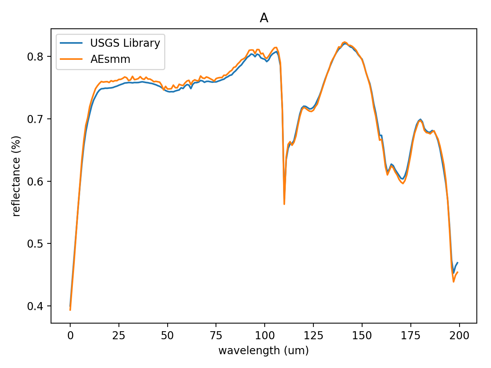

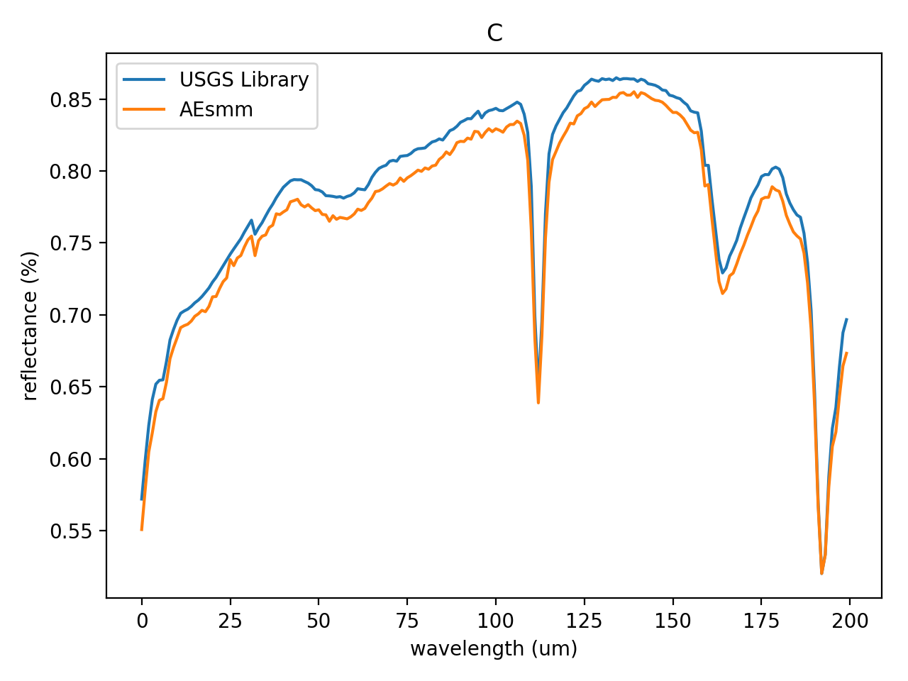

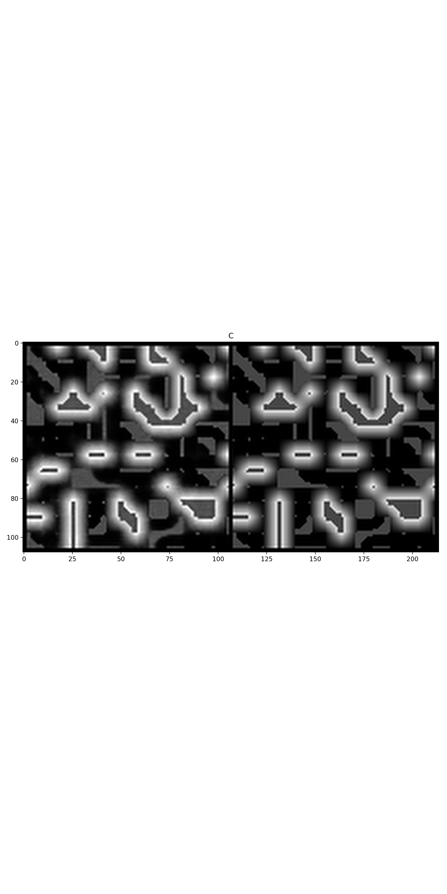

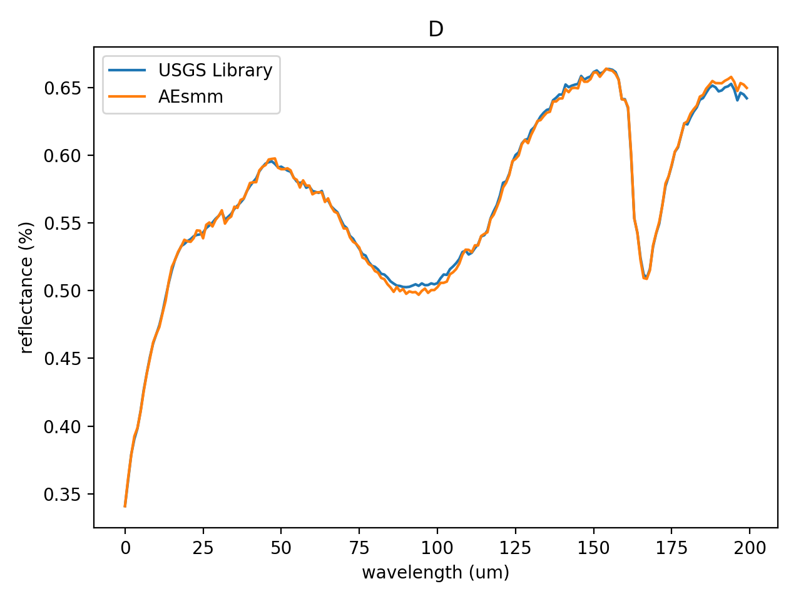

## SNR = : 40 

### Comparison between the ground-truth and extracted endmembers using PPI, N-FINDR, VCA using SAD for the simulate Dataset.

| Endmembers   |   AEsmm |
|:-------------|--------:|
| A            |  **0.0107** |
| B            |  **0.0132** |
| C            |  **0.0042** |
| D            |  **0.0074** |

### SAD Statistics for Cuprite Dataset. 

| Statistics   |   AEsmm |
|:-------------|--------:|
| _Mean_       |  **0.0088** |
| _Std_        |  **0.0000** |
| _Time_       | **20.0304** |
| _1-Ssim_     |  **0.0807** |
| _Mse_        |  **0.0001** |

### Comparison between the ground-truth and extracted endmembers using PPI, N-FINDR, VCA, using AAD for the simulate Dataset.

| Abundance   |   AEsmm |
|:------------|--------:|
| A           |  **0.1044** |
| B           |  **0.0541** |
| C           |  **0.1016** |
| D           |  **0.0623** |

### AAD Statistics for Cuprite Dataset. 

| Statistics   |   AEsmm |
|:-------------|--------:|
| _Mean_       |  **0.0806** |
| _Std_        |  **0.0000** |
| _Time_       | **20.0304** |
| _1-Ssim_     |  **0.0807** |
| _Mse_        |  **0.0001** |

### Comparison between the ground-truth Laboratory Reflectances and extracted endmembers using PPI, N-FINDR, VCA using SID for the Cuprite Dataset.

| Endmembers   |   AEsmm |
|:-------------|--------:|
| A            |  **0.0001** |
| B            |  **0.0003** |
| C            |  **0.0000** |
| D            |  **0.0001** |

### SID Statistics for Simulated Data. 

| Statistics   |   AEsmm |
|:-------------|--------:|
| _Mean_       |  **0.0001** |
| _Std_        |  **0.0000** |
| _Time_       | **20.0304** |
| _1-Ssim_     |  **0.0807** |
| _Mse_        |  **0.0001** |

### Comparison between the ground-truth Laboratory Reflectances and extracted endmembers using PPI, N-FINDR, VCA using AID for the Cuprite Dataset.

| Abundance   |   AEsmm |
|:------------|--------:|
| A           |  **0.2393** |
| B           |  **0.1663** |
| C           |  **0.6536** |
| D           |  **0.1965** |

### AID Statistics for Simulated Data. 

| Statistics   |   AEsmm |
|:-------------|--------:|
| _Mean_       |  **0.3139** |
| _Std_        |  **0.0000** |
| _Time_       | **20.0304** |
| _1-Ssim_     |  **0.0807** |
| _Mse_        |  **0.0001** |

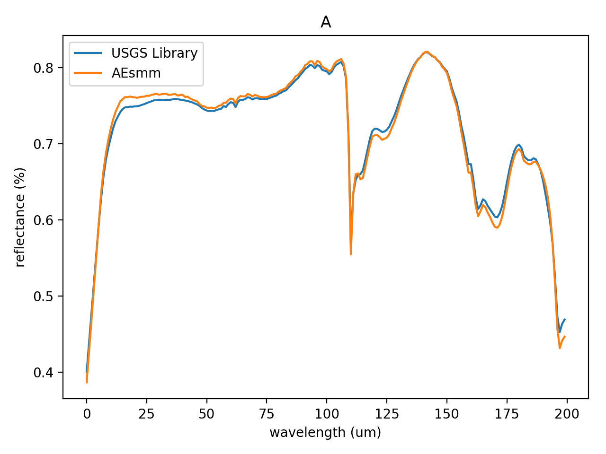

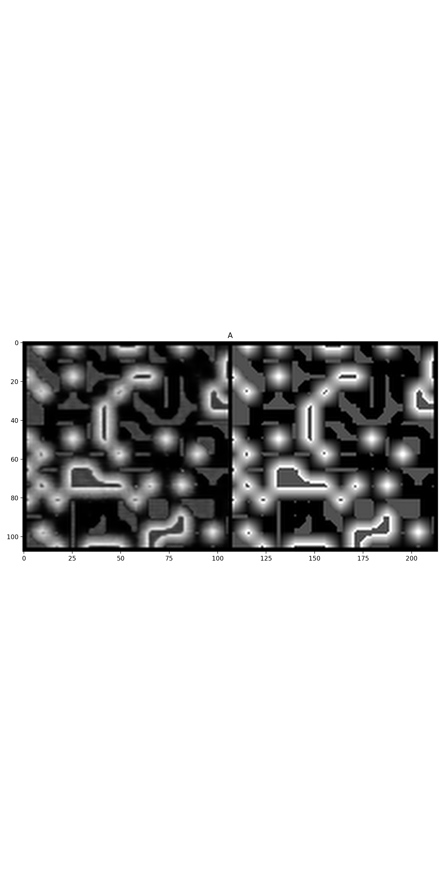

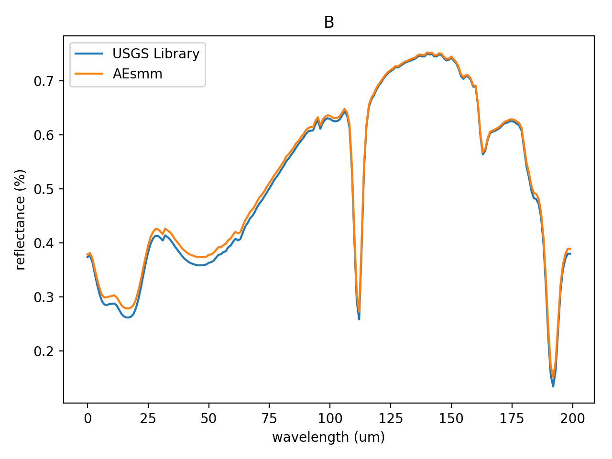

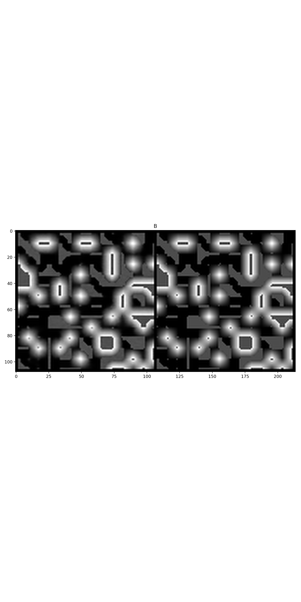

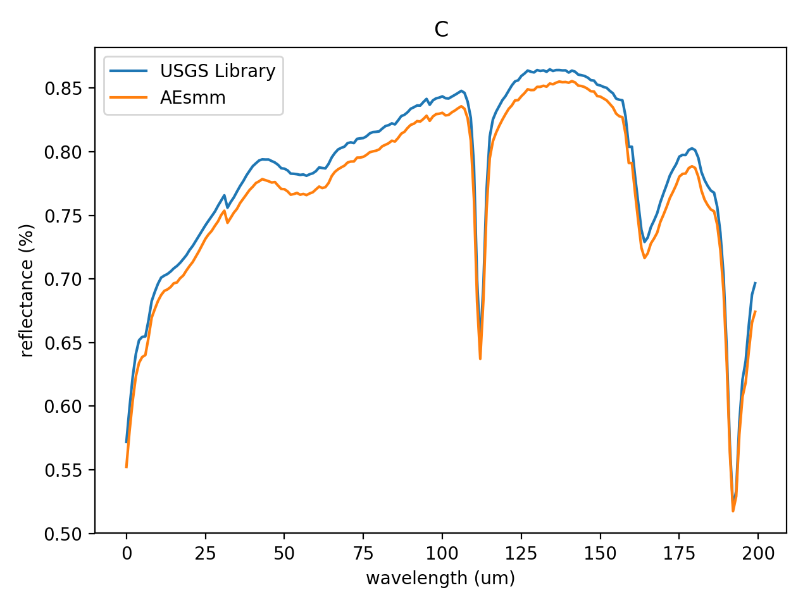

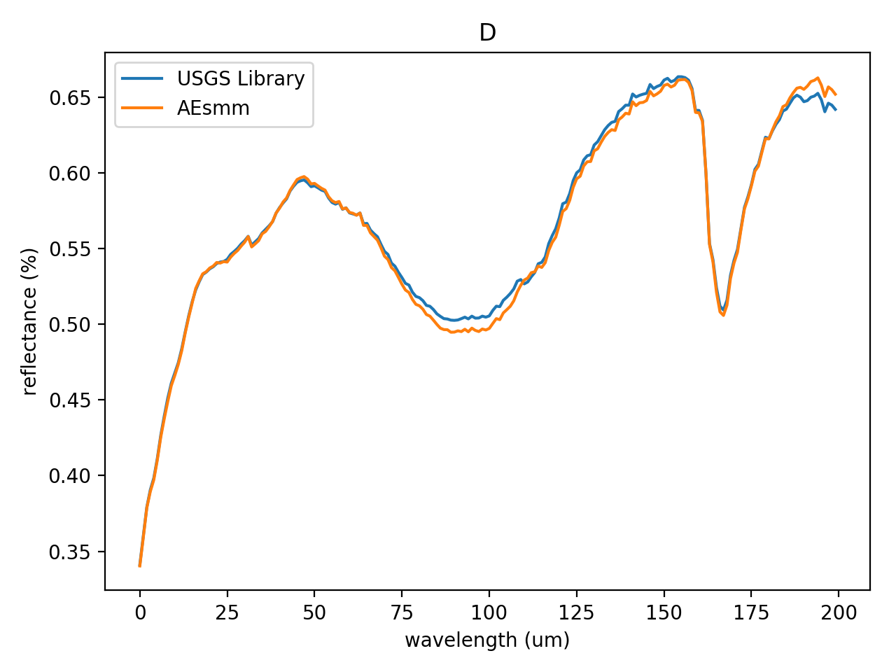

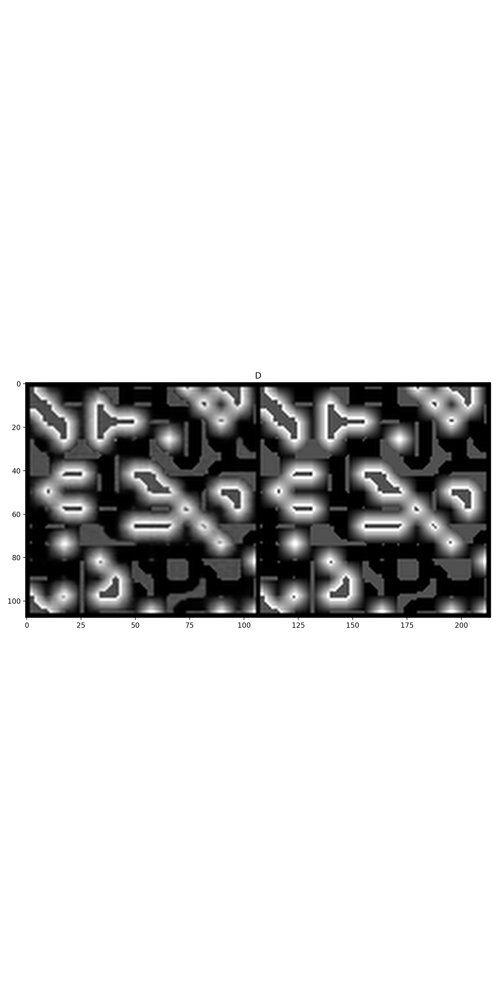

